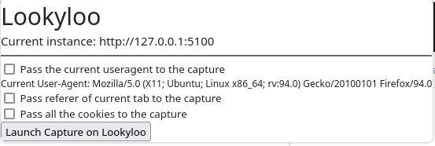

This is a web extension to submit a URL (along with with its context) to a Lookyloo instance.

**Disclaimer**: This extension is aimed for users of [Lookyloo](https://www.lookyloo.eu)
who have their own instance of the platform. It requires invasive  permissions
and if used incorrectly, it may result in sharing cookies with third parties,
potentially resulting in allowing them to login on websites without your consent.
If you simply want to submit URLs to a lookyloo instance, you can give it a try
on the [demo interface](https://lookyloo.circl.lu).

# Features

The plugin will allow you to easily submit the URL if the tab you're currently seeing
in your browser and you can optionnally pass along the following parameters:
* The User-Agent of your browser (it will otherwise default to the ones configured in Lookyloo).
* The referer of the curent page (if any).
* The **complete** cookie jar of your browser. This feature is *dangerous* as it will
  most probably contain cookies that could be used to login as yourself on different websites,
  even if they have no relationship with the webside you're currently viewing and are capturing.
  This setting must only be used if you have full control of the Lookyloo instance
  doing the capture. **Note**: the reason we're sending the complete cookie jar is
  because it can be useful to see what is happenig when capturing a 3rd party page
  while you're logged-in on social media websites.

# Example in browser



# Installation

You can get the plugin from the [Firefox Add-Ons store](https://addons.mozilla.org/en-US/firefox/addon/lookyloo/).

# Dev notes

You will need to install [web-ext](https://extensionworkshop.com/documentation/develop/getting-started-with-web-ext/) first.

And then you can run the app in development mode with:

```bash
web-ext run
# or if it doesn't work
MOZ_ENABLE_WAYLAND=1 TMPDIR=~/tmp npx web-ext run
```


The best ressources for learning how to write and contribute to extensions
are on the [extension website](https://extensionworkshop.com/).

